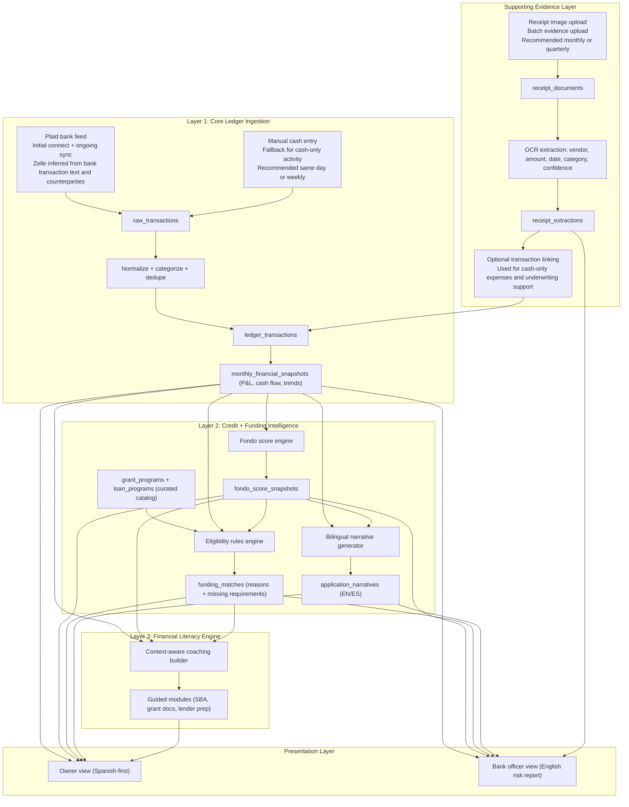

# Fundalo Architecture Flow (MVP)

```mermaid
flowchart TD
    subgraph L1["Layer 1: Core Ledger Ingestion"]
        A1["Plaid bank feed
Initial connect + ongoing sync
Zelle inferred from bank transaction text and counterparties"] --> B1["raw_transactions"]
        A3["Manual cash entry
Fallback for cash-only activity
Recommended same day or weekly"] --> B1
        B1 --> D1["Normalize + categorize + dedupe"]
        D1 --> B4["ledger_transactions"]
        B4 --> E1["monthly_financial_snapshots (P&L, cash flow, trends)"]
    end

    subgraph EVID["Supporting Evidence Layer"]
        A4["Receipt image upload
Batch evidence upload
Recommended monthly or quarterly"] --> B2["receipt_documents"]
        B2 --> C1["OCR extraction: vendor, amount, date, category, confidence"]
        C1 --> B3["receipt_extractions"]
        B3 --> C2["Optional transaction linking
Used for cash-only expenses and underwriting support"]
        C2 --> B4
    end

    subgraph L2["Layer 2: Credit + Funding Intelligence"]
        E1 --> F1["Fondo score engine"]
        F1 --> B5["fondo_score_snapshots"]
        G1["grant_programs + loan_programs (curated catalog)"] --> H1["Eligibility rules engine"]
        E1 --> H1
        B5 --> H1
        H1 --> B6["funding_matches (reasons + missing requirements)"]
        E1 --> I1["Bilingual narrative generator"]
        B5 --> I1
        I1 --> B7["application_narratives (EN/ES)"]
    end

    subgraph L3["Layer 3: Financial Literacy Engine"]
        E1 --> J1["Context-aware coaching builder"]
        B5 --> J1
        B6 --> J1
        J1 --> K1["Guided modules (SBA, grant docs, lender prep)"]
    end

    subgraph V["Presentation Layer"]
        V1["Owner view (Spanish-first)"]
        V2["Bank officer view (English risk report)"]
    end

    E1 --> V1
    B5 --> V1
    B6 --> V1
    B7 --> V1
    K1 --> V1

    E1 --> V2
    B5 --> V2
    B6 --> V2
    B7 --> V2
    B3 --> V2
```
