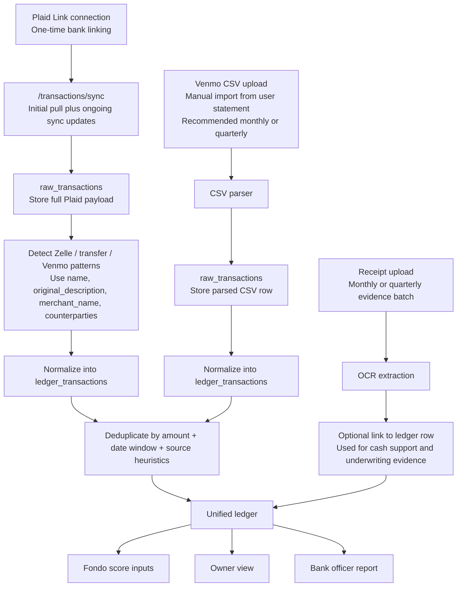

# Fundalo Ingestion Engine

This document focuses on how Fundalo ingests bank and payment-app activity into a unified ledger.

Receipts are included as a supporting evidence layer, not as a required dependency for the first version of the ledger.

## Goal

The ingestion engine must answer three questions:

1. How do we connect to real financial activity?
2. How do we normalize different sources into one ledger?
3. How do we preserve enough evidence for scoring and bank review?

## Sources

### Plaid bank connection

Plaid is used for bank transactions. This is the primary path for detecting:

1. Zelle-like incoming and outgoing transfers recorded in the bank ledger
2. Rent and utility payments
3. Broader cash-flow behavior used for scoring

Important note:
Zelle does not arrive through a dedicated Zelle API here. It appears as bank transaction activity surfaced through Plaid transaction sync results.

### Venmo CSV upload

Venmo is ingested through user-uploaded CSV statements. This is the reliable MVP path for pulling Venmo history into Fundalo.

We parse:

1. `Date`
2. `ID`
3. `Type`
4. `Status`
5. `Note`
6. `From`
7. `To`
8. `Amount`

## Unified Ledger Model

We keep two levels of storage:

1. `raw_transactions`
This stores the original Plaid payload or parsed Venmo CSV row for auditability.

2. `ledger_transactions`
This stores the normalized business-facing transaction used for scoring and reporting.

Receipts live beside this flow:

1. `receipt_documents`
2. `receipt_extractions`
3. optional links to `ledger_transactions`

## Ingestion Flow

## Plaid Detection Rules

For each Plaid transaction, Fundalo stores the full payload and derives a professional display layer from Plaid enrichment fields.

Detection priority:

1. `counterparties[].name`
2. `merchant_name`
3. `name`
4. `original_description`

Special tagging rules:

1. If text contains `ZELLE`, tag as `plaid_zelle_candidate`
2. If text contains `VENMO`, tag as `plaid_venmo_candidate`
3. If text contains `TRANSFER`, tag as `plaid_transfer_candidate`

We preserve both:

1. `counterparty_raw`
2. `counterparty_display_name`

That keeps the UI readable while preserving audit evidence.

## Venmo Deduplication Rules

Venmo rows should be checked against Plaid-origin transactions using:

1. Same absolute amount
2. Date within plus or minus one day
3. Optional text similarity on note / description

If matched:

1. Keep the new Venmo row for evidence
2. Mark the normalized ledger row as `is_duplicate = true`
3. Preserve provenance so the officer report can show where the transaction came from

## Why this matters for Fondo Score

The unified ledger powers:

1. Stability
Recurring income patterns, especially Zelle-like deposits
2. Reliability
Recurring rent and utility payment behavior
3. Volume
Monthly net cash flow and operating capacity

## Recommended MVP boundary

Build first:

1. Plaid connection and sync
2. Venmo CSV upload
3. Raw transaction storage
4. Ledger normalization
5. Deduplication
6. Fondo score inputs

Add after core ledger is stable:

1. Receipt reconciliation
2. Advanced counterparty enrichment
3. Automated grants and loans refresh jobs
