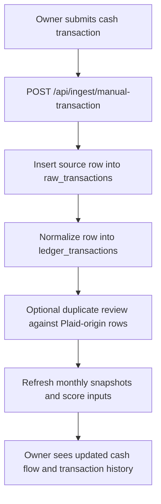
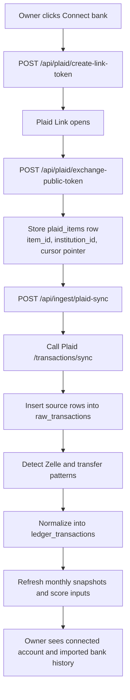
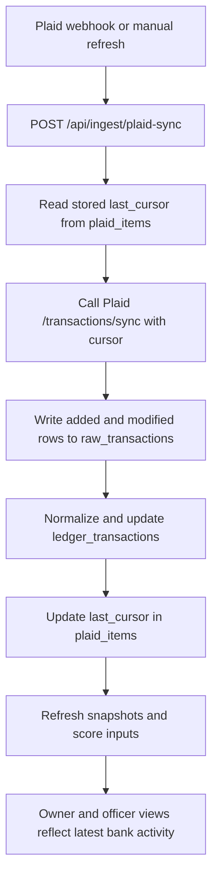
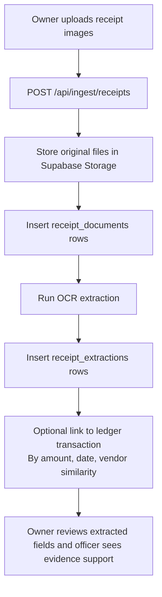

# Fundalo User Flows

This document defines the operational workflows for Fundalo's three data-ingestion paths:

1. Manual cash entry
2. Plaid bank connection and Zelle detection
3. Receipt upload and evidence linking

The goal is to make the trigger, API entry point, storage writes, and user-visible result explicit before implementation.

## Trigger types

Fundalo has three trigger categories:

1. User-triggered
The owner clicks a button, uploads a file, or submits a form.

2. Plaid-triggered
Plaid sends a webhook indicating new transaction updates are available.

3. System-triggered
The backend runs normalization, deduplication, snapshot generation, or score refresh after ingestion succeeds.

## Manual cash workflow

### User story

The owner records a cash sale or expense that does not appear cleanly in the bank feed so Fundalo can include it in the business ledger.

### Trigger

User action in the frontend:

1. Owner clicks `Add cash transaction`
2. Owner enters date, amount, direction, and description
3. Frontend sends JSON to `POST /api/ingest/manual-transaction`

### Flow

### Backend steps

1. Validate required fields
2. Reject zero-value or malformed entries
3. Insert the row into `raw_transactions` with `source = cash_manual`
4. Map the row into canonical ledger fields
5. Check for obvious Plaid overlap if needed
6. Insert normalized row into `ledger_transactions`
7. Recompute snapshots or queue recomputation

### User-visible result

The owner sees:

1. The new cash transaction in the ledger
2. Updated revenue and expense view
3. Updated Fondo score inputs if the entry changes the last 6 months

## Plaid bank and Zelle workflow

### User story

The owner connects a bank account so Fundalo can pull transaction history and infer Zelle activity from bank ledger records.

### Important note

The user does not upload Zelle directly.
Fundalo detects Zelle-like activity inside bank transactions returned by Plaid.

### Initial connection trigger

User action in the frontend:

1. Owner clicks `Connect bank`
2. Frontend requests a Plaid Link token from `POST /api/plaid/create-link-token`
3. Frontend opens Plaid Link
4. Plaid returns a `public_token`
5. Frontend posts the `public_token` to `POST /api/plaid/exchange-public-token`

### Initial sync flow

### Ongoing sync trigger

Two valid triggers:

1. Plaid webhook `SYNC_UPDATES_AVAILABLE`
2. Owner clicks `Refresh bank data`

Both should end up calling the same sync route:

1. `POST /api/ingest/plaid-sync`

### Ongoing sync flow

### Zelle classification logic

During normalization, the backend checks:

1. `counterparties[].name`
2. `merchant_name`
3. `name`
4. `original_description`

If strings contain `ZELLE`, tag the row as a Zelle candidate.

Examples:

1. `sub_category = Zelle_Income`
2. `source_tag = plaid_zelle_candidate`

### User-visible result

The owner sees:

1. A linked bank source
2. Imported bank transactions
3. Zelle-like deposits tagged clearly
4. Updated cash-flow trends and score inputs

## Receipt workflow

### User story

The owner uploads receipt images to support cash-only expenses, supplier proof, and underwriting evidence.

### Role in MVP

Receipts are not required for the ledger to work.
They are a supporting evidence layer.

### Trigger

User action in the frontend:

1. Owner clicks `Upload receipts`
2. Owner selects one or more images
3. Frontend sends `multipart/form-data` to `POST /api/ingest/receipts`

### Flow

### Backend steps

1. Store original image in a private Storage bucket
2. Insert metadata into `receipt_documents`
3. Run OCR extraction
4. Store extracted vendor, amount, date, and category guess in `receipt_extractions`
5. Optionally link extraction to a ledger row
6. Keep manual review path for low-confidence matches

### User-visible result

The owner sees:

1. Uploaded evidence files
2. Extracted receipt fields
3. Optional matched transaction
4. Ability to correct OCR output

The bank officer sees:

1. Supporting evidence for expenses or supplier history
2. Better credibility for informal cash activity

## Implementation order

Recommended build order:

1. Plaid connect and sync workflow
2. Manual cash workflow
3. Receipt evidence workflow

This order keeps the core ledger path simple while still preserving the evidence layer for later integration.
